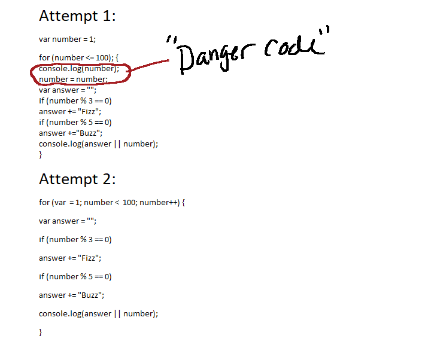

# HW-3 Readme for Chelsey Hauge

## The struggle is real:
I absolutely cannot math, so this made my head hurt probably way more than it should have. I can't even begin to explain how much numbers go in my head and come out all jumbled up, so this kind of project is not my strong suit.

That being said, so far I'm managing. The hints definitely help, and I'm thankful that I remember a little bit of this from previous coding classes.

## It got worse:

Let's just take a second to talk about this mishap:

This code shall henceforth be known as "Danger Code".
So, being naturally confused by numbers because, as I stated earlier, I'm not good with numbers, I was throwing things together, trying to get *something* to stick. Reading through the book, watching the videos, trying anything and everything.

Because that's what a lot of coding is, right? Trial and error?

Seems like when there are numbers involved, there's a *lot* of error for me.

### So what happened with the "Danger Code"?
I crashed my browser. Several times. Did I mention it lagged my whole computer out for a few minutes? Yeah. It did, and it was scary, and I am never inputting that bit of code *ever again*.

### Attempt 2:
Better, but I still wasn't happy with it. The word "number" repeating that many times really bothered me. Oh, and attempt 2 wasn't even the official attempt 2, because originally I had `number <= 100`. Eventually I figured out that I don't even *really* need the `=` just `<` for it to work correctly.

### `i` instead of `var`
I also figured out that I could use `i` instead of `var` to define my variable, which solved my whole "number makes things look repetitive and cluttered" problem.

### Conclusions:
This was a challenging assignment for me. I *really, really* don't do good with numbers on any level, so I have a feeling I'm going to continue to struggle with this. But, on the bright side, I overcame that struggle this week, even if it's just temporary!
That in itself is progress, so I'm happy!
