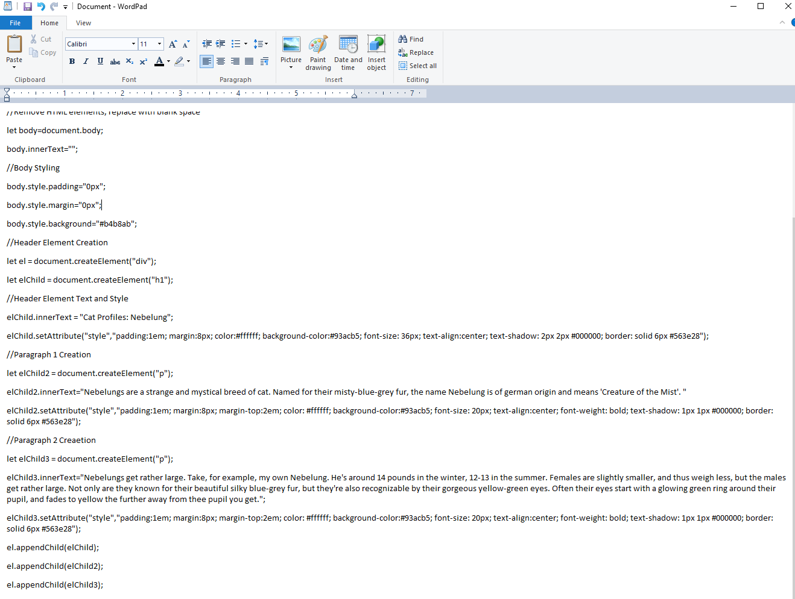

# HW-6 Readme for Chelsey Hauge

## 3:17AM Update:
*Internal screaming.*

It took me *far* too long to get my header working. I was over thinking it **so** much. Not going to lie, it took me around 3 hours to figure it out. Blame anxitey and stress, maybe?

Either way, I figured it out! And now everything else seems so simple now that I actually know what I'm doing!

### Backing up code! Just in case!

I decided it might be a good idea to keep a backup copy of my "last working code" while actively making changes to my document. That way if I mess up somewhere and can't figure out what's messing up, I can revert back to my code that was working before!

### Progress:

So far I have a heading, two paragraphs, and images in my folder that I'll now have to figure out how to insert. Here's hoping I can do so relatively easy!

### Images!
I *finally* put images into my page. It took me a while to figure out. For some reason the initial code I was using wasn't working, despite going off of the examples. It just didn't want to work for me. But I worked through it and made it work. I'm still not entirely sure what was wrong, but at this point I'm tired and trying to power through it.

## DONE.
I added my link, which also gave me a little bit of an issue, but I figure it out easily enough.

## Conclusions:
This actually wasn't *too* bad. I did it in one night, although it was a *long* night, but it's not too bad. I find I do my best work when I just sit down and power through it, rather than picking at it little bits at a time. No idea why, but it works.

I also like the chance to be creative. I'm much better at creative things than I am problem solving. Plus, any chance I get to share more pictures of my cat is fine by me!
