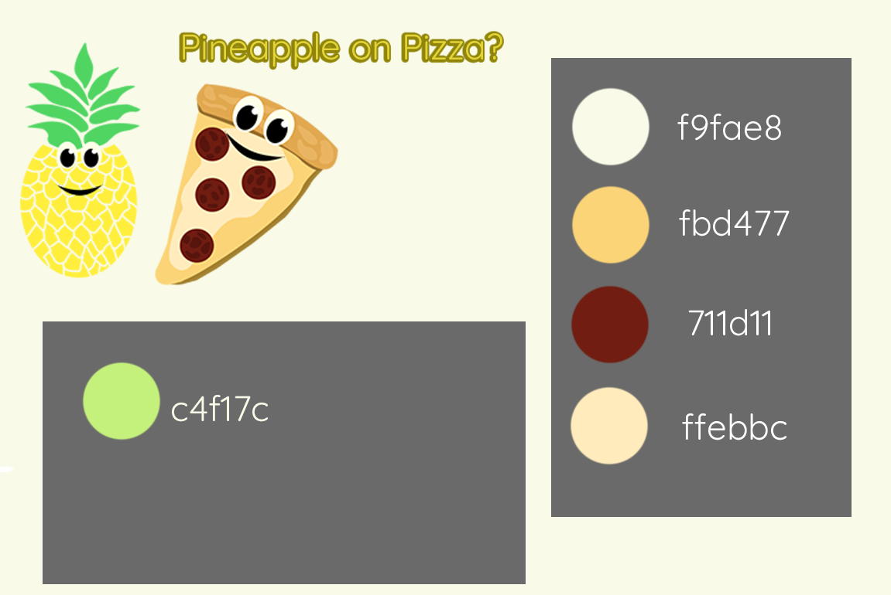

# HW-7 Readme for Chelsey Hauge

## 17 Hours Later...
I don't mean to alarm anyone, but I have spent the past 17 hours straight doing nothing but trying to get this project done.

This was beyond confusing, but I feel like I finally figured it out. I had to separate everything out, bit by bit, and physically write it down on paper in order to keep everything straight.

## Planning:

In case anyone was curious about my creative process, I usually create a visual image for myself with the colors I'm going to use, as well as their hex codes, and any other images. I like to have a solid color palette before starting any project!

The images were custom made for this project, which were created on a separate day, so they are not factored into the 17 hours of coding.

## Struggles:
My struggles this time around included not being able to get my form box to function properly for the first 8-ish hours. I eventually gave up on it, started doing the rest of the coding, and then decided I was trying to do too much. I ended up deleting a bunch of other options I had because I was making it too complicated, and upon deleting things my form box finally decided to work for some reason! HA. Of course it would do that.

And, I had some additional weird issues where my buttons kept showing up after each selection, so you could essentially go back to the first "page" but both options wouldn't be there...

This was a *lot* of trial and error, but I finally got it done!

## Conclusions:
It's really frustrating when you don't feel like you're making any progress, but as soon as you get one little thing to work, it's suddenly really satisfying and such a relief to finally make progress!

I realize in some ways my design is fairly simplistic, but I feel like it fits the theme of the story well despite being simple, and where I didn't include a lot of fancy graphics, I *did* make custom images (the pineapple and the pizza).

I'm proud of it, and I'm fairly certain I covered the requirements, but then again, I'm running on empty after coding all night, so it could be wishful thinking! All things considered, seeing as how I was out of commission most of the week with a hand injury, I'd say I did pretty good!

And now, I must *finally* sleep!
